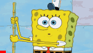

# progressBarAdder

This is a simple tool to add progress bar to `.gif` file. It mainly consists of two processes:
- Add progress bar to the input gif
  - However, the result gif can be (very) big, so we need optimize it.
  
- Optimize the result gif using [`gifsicle`](https://github.com/kohler/gifsicle), to be a smaller size as we expected.

## usage

```bash
$ python main.py -h

optional arguments:
  -h, --help            show this help message and exit
  --input_gif_path INPUT_GIF_PATH, -i INPUT_GIF_PATH
                        the path to input gif file
  --output_gif_path OUTPUT_GIF_PATH, -o OUTPUT_GIF_PATH
                        the path to output gif file
  --bar_height_ratio BAR_HEIGHT_RATIO, -ratio BAR_HEIGHT_RATIO
                        the ratio of progress bar height vs. gif image height
  --bar_color BAR_COLOR, -color BAR_COLOR
                        the color of progress bar
  --tmp_frame_dir TMP_FRAME_DIR, -tmp TMP_FRAME_DIR
                        the temporary directory to save immediate images
```

For example:
```bash
$ python main.py -i ./doc/SquarePants.gif

```
We get the output:
```bash
 ===== out info: =====
 - progress bar added successfully!
 - input gif size: 23.34 KB, output size 91.61 KB. 
Would you like to optimize for smaller size? [Y/N] 
Y
What is your expected size? [in KB]
20
Try optimize level = 3, lossiness = 20, get optimized size 20.17 KB
Try optimize level = 3, lossiness = 30, get optimized size 19.69 KB
Done! try optimize level = 3, lossiness = 30, get optimized size 19.69 KB
```
Then we can get the result `gif` with progress bar added, and it is optimized to be 19.69 KB, which is as small as we want. The result gif is saved in the same folder of input gif by default.

